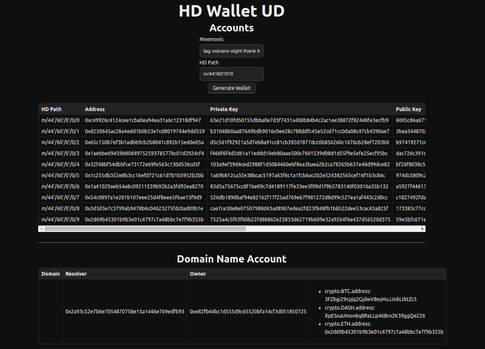

# HD Wallet UD Demo

This is a simple HD Wallet implementation in JavaScript and integrated with the Unstoppable Domains.

## Preview

## Development

Run `pnpm install` to install the dependencies. Then run `pnpm run dev` to start the development server.

## Deployment

Run `pnpm build` to build the app for production. The build is minified and the filenames include the hashes.
